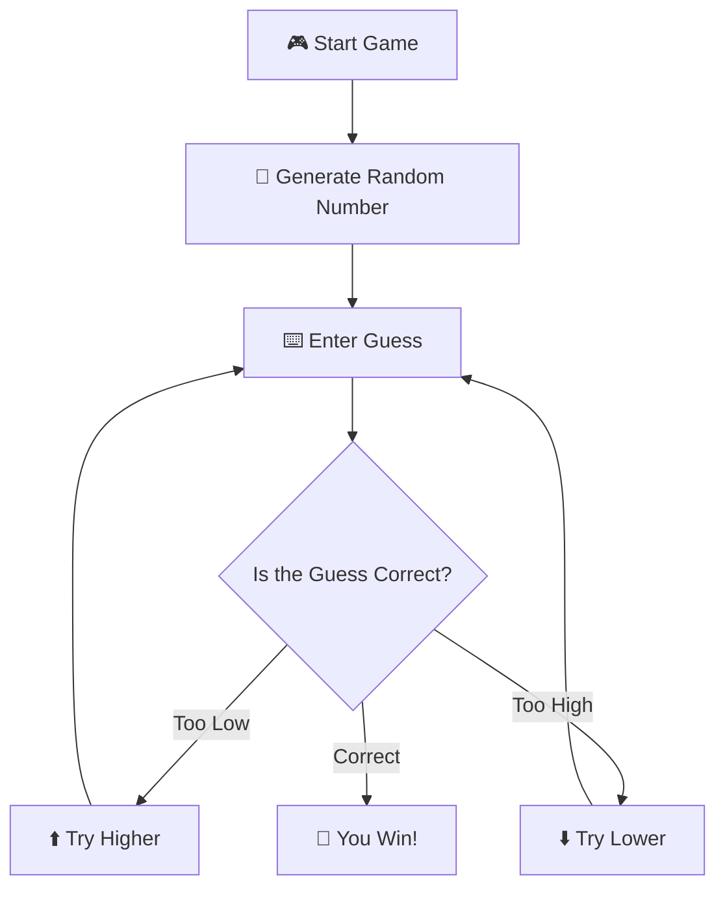

<div align="center">


### 🎯 Guess the Number

**A simple terminal-based number guessing game written in C++.**

<br>


<br>

```text
╭──────────────────────────────────────╮
│                                      │
│          🎯 GUESS THE NUMBER         │
│                                      │
│       ┌──────────────────────┐       │
│       │   ?  ?  ?  ?  ?      │       │
│       └──────────────────────┘       │
│                                      │
│        Can you find the number?      │
│                                      │
╰──────────────────────────────────────╯
```

</div>

---

## 🎮 About

A small **C++ guessing game** where the player tries to find a randomly generated number.

The game gives feedback after each guess, helping you narrow down the answer.

---

## 🧩 How It Works



The basic idea:

```text
        🎲 Random Number
               │
               ▼
        ┌─────────────┐
        │ Your Guess  │
        └──────┬──────┘
               │
       ┌───────┼───────┐
       ▼       ▼       ▼
    ⬆️ Higher  🎯       ⬇️ Lower
               │
               ▼
           🏆 WIN!
```

---

## ✨ Features

* 🎲 Random number generation
* ⌨️ Interactive terminal input
* ⬆️ Higher / lower hints
* 🎯 Win detection
* 💻 Runs entirely in the terminal
* ⚡ No external libraries

---

## 🖥️ Example

```text
╭──────────────────────────────╮
│       🎯 GUESS THE NUMBER    │
╰──────────────────────────────╯

I'm thinking of a number...

Enter your guess: 50

⬇️ Too high!

Enter your guess: 25

⬆️ Too low!

Enter your guess: 37

🎯 Correct!

🏆 You guessed the number!
```

---

## 🛠️ Getting Started

### Clone

```bash
git clone https://github.com/Nimbu-paani/Guess-the-number.git
cd Guess-the-number
```

### Compile

```bash
g++ guess_the_number.cpp -o guess-the-number
```

### Run

```bash
./guess-the-number
```

> Requires a C++ compiler such as **G++**.

---

## 📁 Project Structure

```text
Guess-the-number/
│
├── guess_the_number.cpp
├── LICENSE
└── README.md
```

---

## 🚀 Future Ideas

* [ ] 🔢 Difficulty levels
* [ ] ❤️ Limited attempts
* [ ] 🏆 Score system
* [ ] 📊 Statistics
* [ ] 🔄 Replay option
* [ ] 🎨 Colored terminal UI

---

## 📜 License

This project is licensed under the **GNU General Public License v3.0**.

See [`LICENSE`](./LICENSE) for details.

---

<div align="center">

### 🎯 Think you can guess it?

**One number. Infinite possibilities.**

<br>

⭐ **If you enjoyed the project, consider starring the repository.**

<br>


</div>
